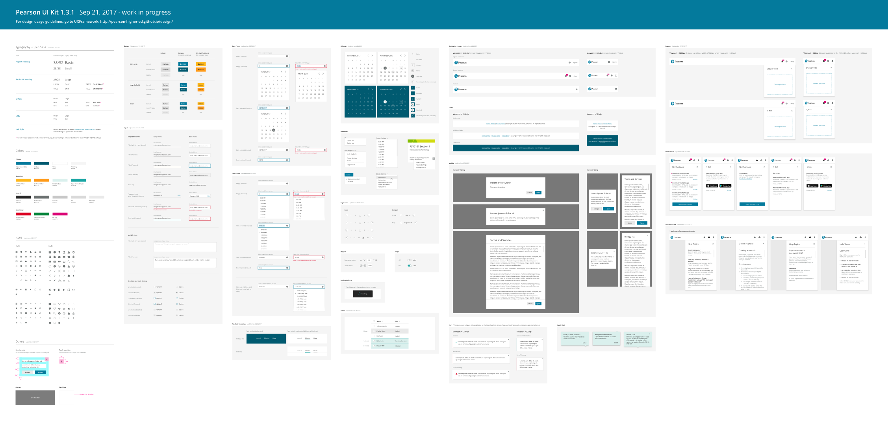

The UI Kit is a single sketch file which contains mockups and symbols of all the UXF components for easy inclusion in your designs. It is updated periodically with the latest component designs.

 <a class="pe-btn--btn_xlarge" href="https://sketch.cloud/s/8yb48/all/page-1/ui-kit" style="margin-left: 16px;">View on Sketch Cloud</a>

{:.wide}
{:style="margin-top: 40px;"}

## Changelog

### [v1.3.0](./files/Pearson UI Kit 1.3.0.sketch)

* Here is a change
* And another
