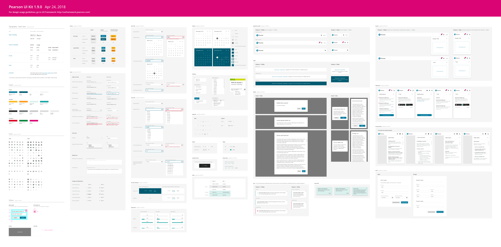

<!-- HEY, DON'T FORGET UPDATE <includes/uikit-download.html> AND THE HOMEPAGE!!!! -->

   <a class="pe-btn--btn_xlarge" href="https://sketch.cloud/s/L49kQ/all/page-1/ui-kit" target="_blank">Preview</a>

Feb 23, 2018

 * Icons: Added "adobe-acrobat", "comment", "download", "upload", "file-excel", "file-pdf", "file-powerpoint", "file-word", "shopping-cart"

This Sketch file contains all the components from the UX Framework to help you start designing. It is updated frequently. If you see any discrepancies between the UI Kit and the website, please [let us know so we can fix it]({{site.baseurl}}/contact).

### [Wireframe Kit 1.0.0](./files/Pearson Wireframe Kit 1.0.0.sketch)

The components in this file is currently outdated. We are working on getting it updated. In the meantime, if you want to be using the latest designs for wireframing purpose, you can download the UI kit and adjust the component colors to gray scale manually.

{:.wide}
{:style="margin-top: 40px;"}

## Download previous versions

### [v1.7.0](./files/Pearson UI Kit 1.7.0.sketch)
Jan 21, 2018

 * Breadcrumbs: NEW

### [v1.6.0](./files/Pearson UI Kit 1.6.0.sketch)
Jan 3, 2018

 * Inputs: Added Select Inputs
 * Progress Bar: NEW

### [v1.5.0](./files/Pearson UI Kit 1.5.0.sketch)
Dec 5, 2017

 * Icons: Added "Link" and "Breadcrumb" icons

### [v1.4.0](./files/Pearson UI Kit 1.4.0.sketch)
Oct 26, 2017

 * Modal: Adjusted the position of the "X" icon
 * Email Template: NEW
 * Forms: NEW

### [v1.3.0](./files/Pearson UI Kit 1.3.0.sketch)
