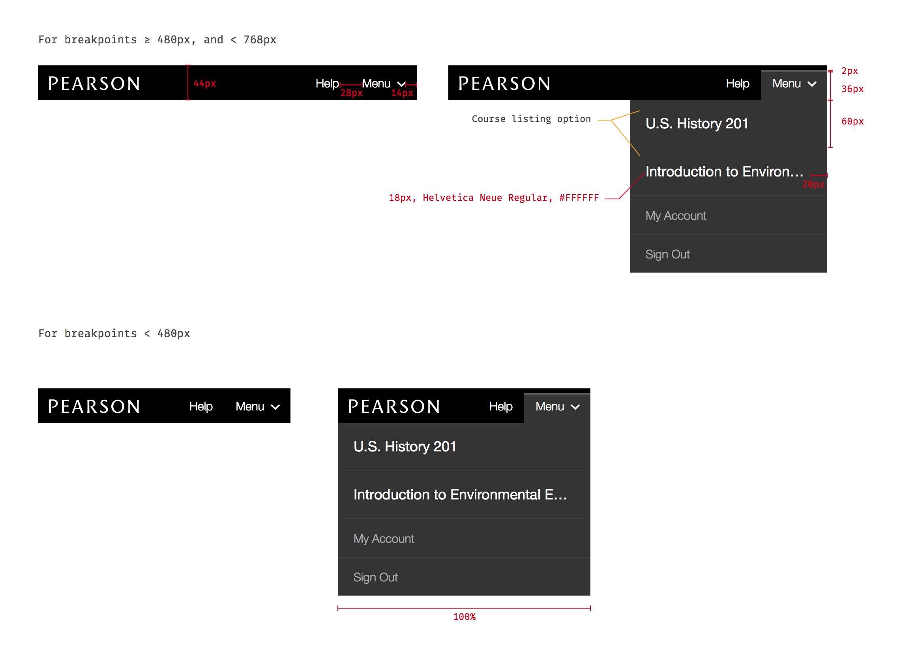

* TOC here
{:toc}

## Overview

This component contains and displays global tools and navigation across the next gen platform.

It offers a simple and consistent way to include standard behavior such as sign in/sign out, help content, and global navigation. For courses, it will present local navigation at mobile breakpoints. The header can be presented in four different modes depending on the context it's in. A user's first interaction with the header will likely be the [Signed Out Mode](#anonymous-mode) which displays only the most basic information (usually including a sign in link). After signing in the [Basic Mode](#basic-mode) represents the 'default' header, offering functionality such as account management and sign out. Once the user launches a specific course the [Course Mode](#course-mode) adds a few features, most notably local navigation for mobile breakpoints. In situations where the user's session is managed by a third party (for example 3PL/LMS integration) the [Integration Mode](#focus-mode) will remove distracting/irrelevant navigation options.

- Pearson branding/navigate to home
- Standard help link
- Sign in/Sign out
- My Account
- Local navigation for courses (at mobile breakpoints)
- Accessibility best practices
- Mobile ready responsive design

<aside class="usage" markdown="1">
Every application that's a part of the next gen platform should display the relevant mode of this header in order to promote a consistent experience.
</aside>

## Signed Out Mode

This is the simplest version of the header, just displaying the Pearson logo (with no link interaction), the help link, and (optionally) a Sign In link. The help link is designed to trigger the [Contextual Help component]().

<aside class="usage" markdown="1">
The user is signed out
</aside>

### Options

#### Remove sign in link
There is a single configuration option to remove the "Sign In" link.

<aside class="usage" markdown="1">
Displaying the sign in link in the header would be redundant (e.g. on the actual sign in page).
</aside>

Here is an illustration of a lemon.

But you really wanted an orange, I know.

## Basic Mode

Represents the default signed in experience. Expands on the Signed Out Mode by making the Pearson Logo a home link (currently [www.console.pearson.com](http://console.pearson.com)) and including the *User Menu*.

The User Menu is labelled with the user's first name and contains My Account and Sign Out options. At widths less than 768px it is condensed into the *Mobile Menu* which relabels the dropdown as "Menu" and extends it with a list of courses (if the consuming app has that information).

<aside class="usage" markdown="1">
The user logs in to a standard Pi session and needs a default header experience
</aside>

### Options

#### Course listing
The Mobile Menu can display a list of Next Gen courses for the current user. If the list is longer than five items in length it's truncated and a "See X more courses" item is added at the bottom.

<aside class="usage" markdown="1">
The consuming application contains a list of courses for the current user.
</aside>

Here is an illustration of a lemon.

But you really wanted an orange, I know.

Here is an illustration of a lemon.

But you really wanted an orange, I know.

## Course Mode

At desktop sizes this is similar to the Basic Header. The Mobile Menu gains an "All Courses" link and any local navigation for the course. The Course Mode also offers the ability to enable a light theme.

<aside class="usage" markdown="1">
A user launches a specific product (such as Revel, Pearson Reader, etc.) with local navigation
</aside>

### Options

#### Course navigation
At narrower breakpoints the Mobile Menu should contain the navigation for the course. The title of the current course will head this section.

<aside class="usage" markdown="1">
The course offers any high level local navigation options
</aside>

#### Light theme
The header can switch it's color from black to a light gray.

<aside class="usage" markdown="1">
The user is viewing a reading, assessment, or some other type of content which requires their complete focus
</aside>

Here is an illustration of a lemon.

But you really wanted an orange, I know.

## Integration Mode

In this version of the header many options are removed that aren't relevant in cases where a user is linking their account to a 3rd party (e.g. BlackBoard, Canvas, or other LMSs). The Logo is no longer a link and the right side of the header only contains a help link.

<aside class="usage" markdown="1">
The user's session is managed by a third party and the user shouldn't have access to platform session features (e.g. sign out, My Account). Specifically, this applies to 3PL/LMS integration scenarios.
</aside>

Here is an illustration of a lemon.

But you really wanted an orange, I know.

## Redlines

For detailed documentation on colors, typography, sizes, spacing, etc. please see the [redlines available here](./assets/redlines.zip).
