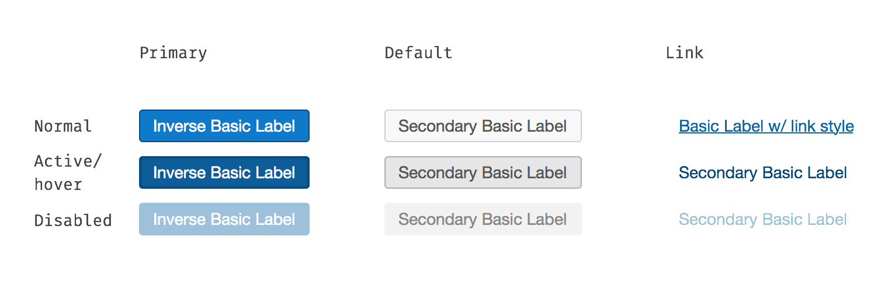

* TOC here
{:toc}

## Overview

This component defines the standard visual style for buttons.

- Single collection of all button styles
- Multiple button types including Primary, Default, and Link
- Small, Default, and Large button sizes
- Guaranteed compliance with Accessibility contrast requirements

Every instance of a button or button styled link should come from this component. See the sections below for information about when to ease each type of button.

## Button Types

Buttons come in several different types. Each defines a normal, active/hover, and disabled state.

**Primary** indicates the main call to action and should only appear once per group of buttons.

**Default** is your basic button, it can appear multiple times in a given group.

**Link** indicates reduced importance of the option. ('Cancel' options should typically use this style, for example.)

Each of the three button types in their various states.

## Button sizes

Buttons come in small, default, and large sizes. Prefer the default size but feel free to use these other sizes where they would fit better with surrounding content.

Each button type in the two alternative sizes.

## Redlines

Specifications for the primary button type.

Default buttons.

Link style buttons.

Sizing specifications. (See the primary button specifications for the standard button size.)

## Changelog

### 1.0.1
- TWEAKED: Font color on disabled secondary button to be more consistent with Colors component.
- TWEAKED: Inner shadow in active/hover secondary button to more subtle.

### 1.0.0
Initial release
