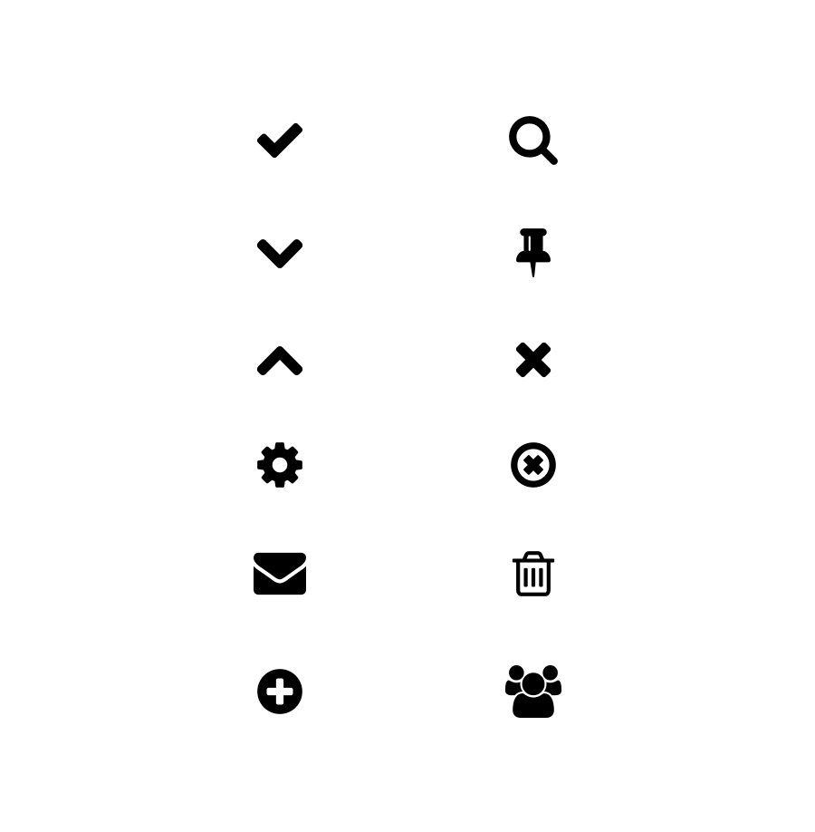
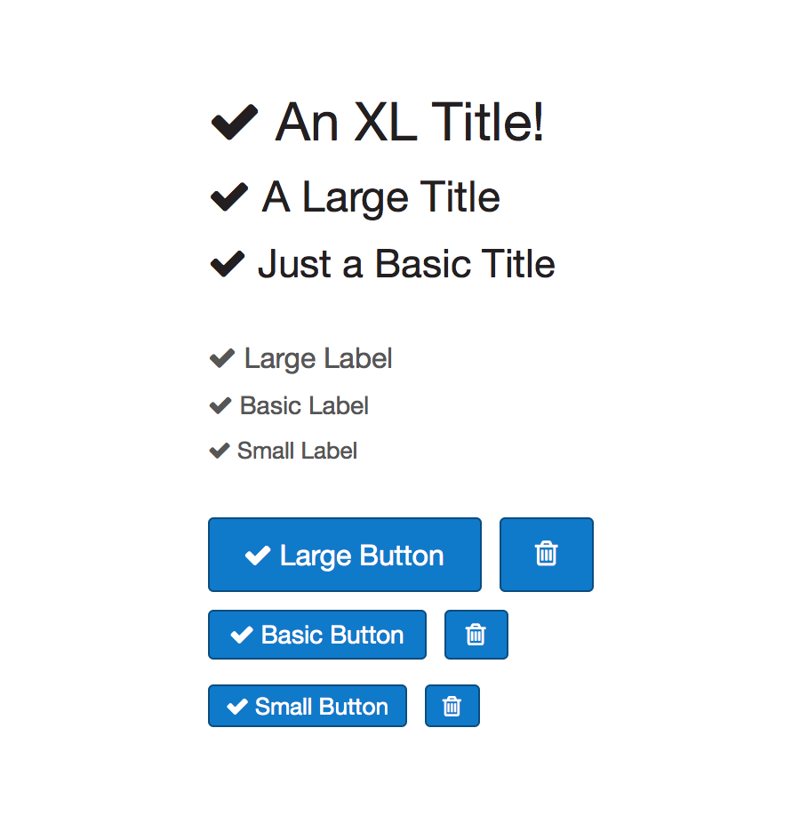

* TOC here
{:toc}

## Overview

Provides a standard set of icons at various sizes.

- Single collection of all icons
- Consistent guidelines for sizing and positioning

All icons should come from this component.

## Available Icons

Icons come from font-awesome and are currently limited to the following set:

- check
- chevron-down
- chevron-up
- cog
- envelope
- plus-circle
- search
- thumb-tack
- times
- time-circle
- trash-o
- users

The current icon repertoire.

## Icon Sizing

Since we're using an icon font each symbol will just inherit the font-size of the surrounding type.

Icons adopting the sizes of their containing type elements.

## Redlines

Just use the specified glyphs from Font Awesome and inherit the font-size of the surrounding text.

A lone symbol should still be wrapped in the relevant type style (e.g. Basic Label).

