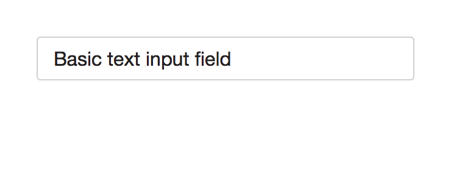
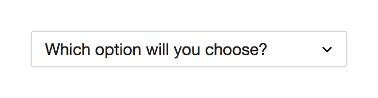

* TOC here
{:toc}

## Overview

This component defines the standard visual style for form elements.

- Single collection of all basic form styles
- Text, TextArea, Radio, Checkbox, Field Labels (required vs. optional), Field Groups
- Guaranteed compliance with Accessibility contrast requirements

<aside class="usage" markdown="1">
Every instance of a form element should come from this component. See the sections below for information about when to use each type of form.
</aside>

## Form States

**Default** is the normal state of the form element.  It is available for user interaction.

**Focus** is initiated when the user interacts with the field.  We currently allow the browser to provide default styling for focus states.

**Disabled** state is a form input that has been disabled and prevents the user from interacting with it.  It is used to indicate an input that has been provided at some point, but is currently unavailable to interaction.

## Text

Text input form elements are to be used for single line text inputs.  Text inputs can have a <i>maxlength</i> character limit applied.  If the user input exceeds the visible width of the text field, the characters will shift to the left so that the last type character sits against the right edge of the field.  Keyboard and mouse controls will still allow horizontal scrolling within the field.

## Text Area

Text area form elements are to be used for multiple lines of text.  If the text <i>overflows</i> the set number of lines allotted for the text area, the text area component will gain a vertical scroll bar.  If the text area element is intended to be <i>resize</i>-able, the controls for this feature will be enabled.  Text areas can be resized vertically, horizontally, or both.

## Select

A default value can be set for the select element if it's recommended for most users.  Bear in mind that a user can easily overlook a preselected item, so use caution when doing so.

The select form element provides a list of options for the user to make a single selection.  

<aside class="usage" markdown="1">
You have a list of 3 or more options for the user to choose from or hiding all options beneath a single trigger is acceptable.
</aside>

<aside class="usage" markdown="1">
You have a list of 15 or more options for the user to choose from.  Consider a text input instead to prevent very long select lists.  An exception to this could be state or country selection.

You want the user to carefully consider all options and do not wish to hide the select list options.
</aside>

## Fieldset Anatomy

A fieldset can contain one or more groupings of paired label and form elements.

Input prompts can be optionally placed inside text fields.

<aside class="usage" markdown="1">
The label of an input field does not fully explain what should be filled into it or when using such a label feels like over-explaining the interface.  

Use when you want to save the space that a label otherwise takes up.  

Use in combination with a label, to further explain what kind of input is needed.
</aside>

## Field Labels

The label always sits above the field element to accommodate long text strings when dealing with internationalization.  When required or optional fields are needed, always opt to append the label with the option which appears less frequently.

<aside class="usage" markdown="1">
Suppose you have a 10 form elements on a screen.  

If the majority of elements are required, use the optional callout and vice versa for an optional majority.  

If there is an evenly matched number of required vs. optional form elements, use the required callout.
</aside>

## Fieldset Groups

A grouped fieldset contains multiple pairs of label and form elements and is used to visually connect these pairings with one another.  A fieldset title can be added to the group.

An alternate visual treatment can be used for more explicit emphasis.

## Radio and Checkbox

Use radio and checkbox form elements for instances where you want the user to carefully consider the options and need to expose all available options.  Styling for Radio and Checkbox is browser default.

<aside class="usage" markdown="1">
The user needs to make a single selection from two or more options.  

You need to present all available options equally.
</aside>

If there are only two mutually exclusive options, combine them into a single checkbox or toggle switch. For example, use a checkbox for "I agree" instead of two radio buttons for "I agree" and "I don't agree."

<aside class="usage" markdown="1">
You need to present users with a choice of one or more options that are not mutually exclusive, or a mixed choice.
</aside>

Unlike radio buttons, where a group of radio buttons represents a single choice, each check box in a group represents a separate, independent choice. When there is more than one option but only one can be selected, use a radio button instead.

## Redlines
[Download the redline specification here](./assets/redlines-01.png)
