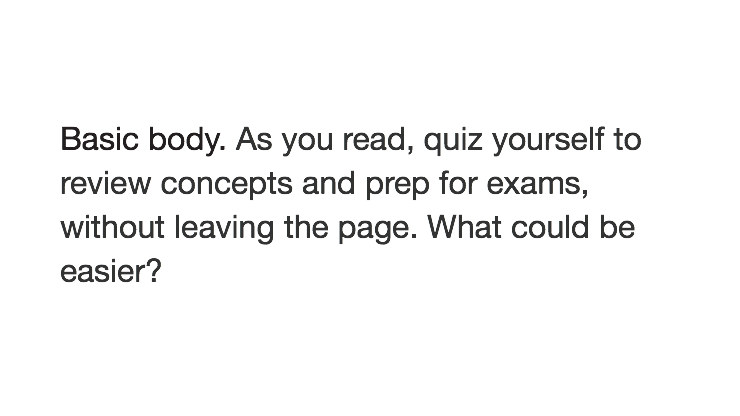
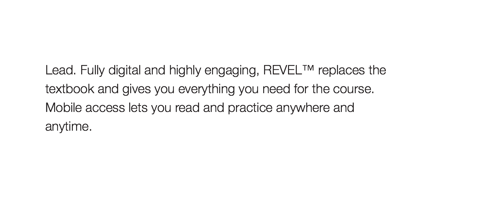
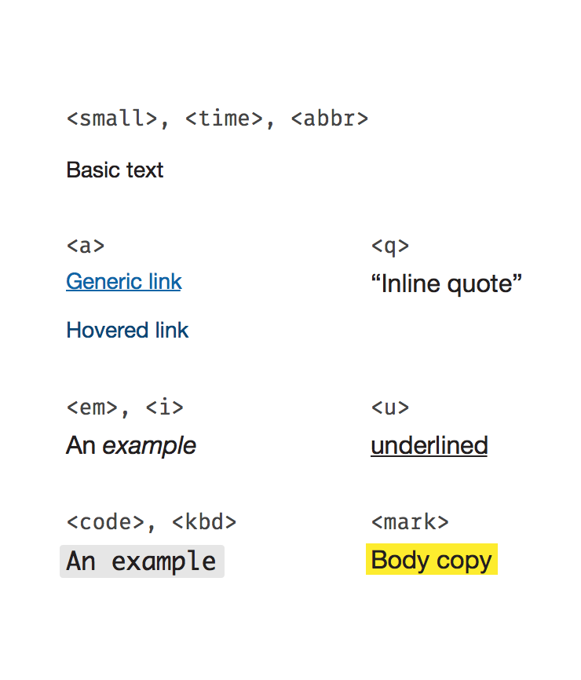
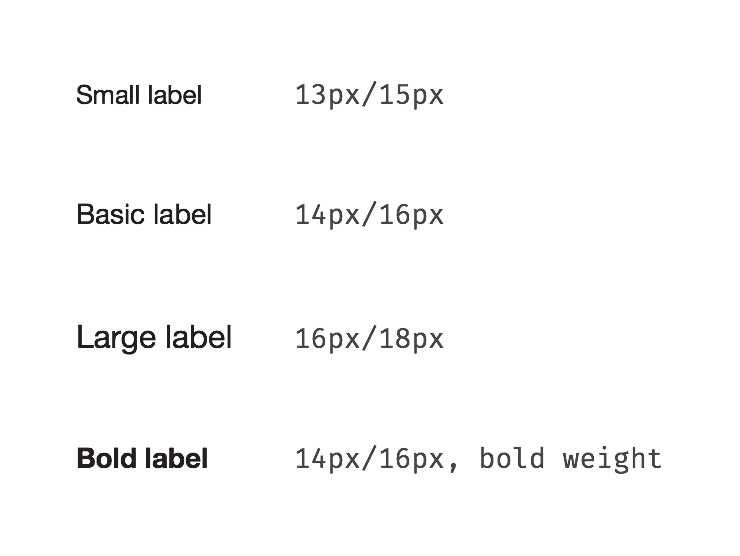
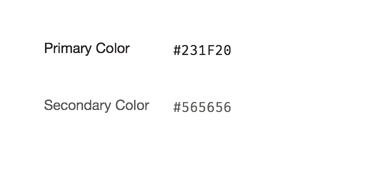
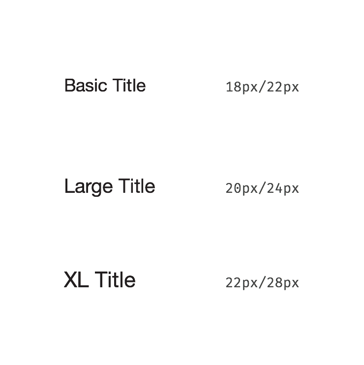
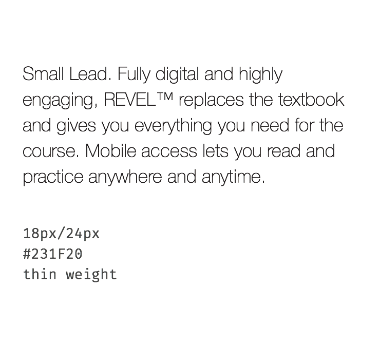
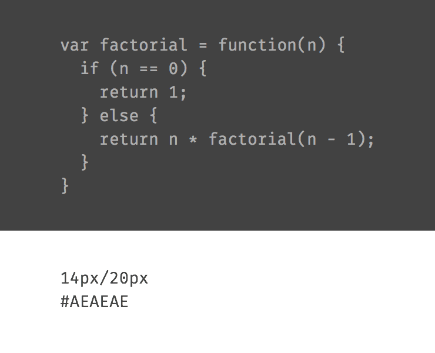
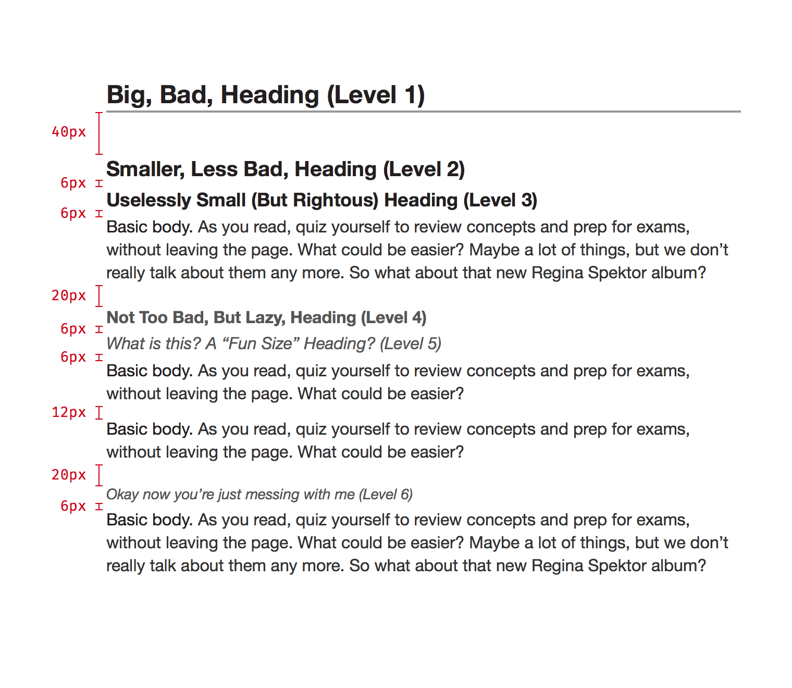

* TOC here
{:toc}

## Overview

This component provides standard typographic styles for the platform.

- Single collection of all typographic styles
- Label styles for UI messages
- Title styles for UI headings
- Copy styles for content
- Inline styles (links, super/sub-script, etc.)
- Meets accessibility contrast requirements

Every instance of text should use a type style defined in this component. If you find a use case not covered by the styles here, make a request to modify this component. (Keeping all type styles in a single component makes it easy to maintain and update them.)

## Font Stacks
All textual elements use the following font stacks:

~~~
font-family: 'Helvetica Neue', Helvetica, Arial, sans-serif;
font-family: Monaco, 'Lucida Console', monospace;
~~~

## Labels

Much of the typography used in a web application consists of short names, labels, or single line bits of content. For example, in Console the course tile displays information like instructor names and course dates with labels.

An example of labels in use on the Console course tile

### Size Variants

There are four different sizes of label, *Basic*, *Small*, *Large*, and *Bold*:

Labels should primarily be used in single line scenarios. Make a particular effort to avoid using bold labels in a multi-line manner.

The four label sizes

### Color Variants

Labels come in two colors, *Primary* and *Secondary*. There is an inverse palette available as well.

Standard colors

Inverse colors

### Allowed Inline Elements

In general, labels should not be styled beyond the basic styles listed above. If necessary, stick to the following list of inline elements.

* `<em>, <i>`
* `<a>`
* `<small>`
* `<time>`
* `<abbr>`

## Titles

Titles are very similar to labels except they demarcate a logical section or container of content. In the previous example, the course name would be a title.

Example title in use on the Console course tile

### Size variants

There are three different sizes of title: *Basic*, *Large*, and *Extra Large*. These sizes will automatically scale down in narrow viewports.

### Allowed Inline Elements
In general, titles should not be styled beyond the basic styles listed above. If necessary, stick to the following list of inline elements.

* `<em>, <i>`
* `<small>`
* `<time>`
* `<abbr>`

Standard title sizes, multiline versions, and the responsive sizes used when the viewport is narrower.

## Copy

When you have a chunk of content to display, use one of these styles. Most regular content will use the *Basic Body* style.

### Lead Variant

There is also a *Lead* variant which can be used for the first paragraph of a message or as part of a hero block for marketing materials.

It will automatically scale down for narrow viewports as well.

### Allowed Inline Elements
Copy is more flexible in this regard that labels or titles. You can include any of the inline elements covered by this component.

### Lists

Both ordered and unordered lists are supported with a nesting depth of three. These should be used to present content within a copy block, not for UI elements.

### Code

Blocks of code (typically `<pre>` tags) are styled on a dark background. (See also the inline elements `<code>` and `<kbd>`.)

## Headings

Headings pair with [copy](#copy) styles to delineate sections within blocks of content. They should not be used for UI elements (see [titles](#titles) instead).

There are six different levels available and should be used in order.

These headings don't change size as the viewport narrows.

## Inline Elements

There are a number of inline elements which can be used to modify the other type styles (see the list of allowed inline elements for each type style).

### Basic Elements

* `<a>`
* `<em>, <i>`
* `<strong>, <b>`
* `<u>`
* `<del>, <s>`
* `<ins>`
* `<q>`
* `, `
* `<mark>`
* `<code>, <kbd>`

### Non-visible Elements

Some inline elements should be used only for semantic reasons and don't effect the visual style. These include:

* `<small>` (note: this element is used to represent side-comments and small print, including copyright and legal text, independent of its styled presentation)
* `<time>`
* `<abbr>`

## Redlines

### Labels

#### Sizes

Small
: - 13px font-size
  - 15px line-height

Basic
: - 14px font-size
  - 16px line-height

Large
: - 16px font-size
  - 18px line-height

Bold
: - 14px font-size
  - 16px line-height
  - bold font-weight

#### Colors

Primary (Light)
: - \#231F20

Secondary (Light)
: - \#565656

Primary (Dark)
: - \#FFFFFF
  - light font-weight

Secondary (Dark)
: - \#AEAEAE
  - light font-weight

### Titles

#### Sizes

Basic
: - 22px font-size
  - 28px line-height

Large
: - 24px font-size
  - 30px line-height

XL
: - 30px font-size
  - 36px line-height

At narrow viewports (< 480px):

Basic
: - 18px font-size
  - 22px line-height

Large
: - 20px font-size
  - 24px line-height

XL
: - 22px font-size
  - 28px line-height

Regular title sizes

Title sizes for narrow viewports (< 480px)

#### Color

All titles are colored \#231F20.

### Copy

#### Basic Body

Font
: - 16px font-size
  - 22px line-height

Color
: - \#231F20

#### Lead

Font
: - 20px font-size
  - 28px line-height
  - light font-weight

Color
: - \#231F20

#### Narrow lead

At narrow viewports (<480px) the lead styles become:

Font
: - 18px font-size
  - 24px line-height
  - thin font-weight

Color
: - \#231F20

#### Lists

These lists should be used to communicate content within a copy block, not as UI elements.

Font
: - Use the same style as Basic Body copy

Spacing
: - 12px above and below a list
  - 6px between list items

Bullets
: - Centered in a 14px box which is left aligned to the surrounding body copy
  - 4px padding separates box from list content
  - 8px left margin for child elements

Numbers
: - Right aligned in a 14px box which is left aligned to the surrounding body copy
  - If the number is too large for a 14px box, expand the box to fit
  - 4px padding separates box from list content
  - 8px left margin for child elements

Note: The expanding box behavior for ordered lists can be achieved with a `display: table` layout.

#### Code

Font
: - Monospace font stack
  - 14px font-size
  - 20px line-height

Color
: - \#AEAEAE
  - \#424242 background-color

### Headers

#### Fonts
Level 1
: - 24px font-size
  - 30px line-height
  - bold font-weight
  - 2px bottom border, #A6A8AB
  - \#231F20 color

Level 2
: - 20px font-size
  - bold font-weight
  - \#231F20 color

Level 3
: - 18px font-size
  - bold font-weight
  - \#231F20 color

Level 4
: - 16px font-size
  - bold font-weight
  - \#565656 color

Level 5
: - 16px font-size
  - italic font-style
  - \#565656 color

Level 6
: - 14px font-size
  - italic font-style
  - \#565656 color

#### Spacing

Header that follows a header
: - 6px margin
  - 40px if top header is Level 1

Header that follows content
: - 20px margin

### Inline Elements

`<small>, <time>, <abbr>`
: - Same as the 'Basic Text' label

`<mark>`
: - \#FDEC2E background-color
  - Only use within Body Copy

`<em>, <i>`
: - italic font-style

`<strong>, <b>`
: - bold font-weight

`<del>, <s>`
: - line-through text-decoration
  - \#565656 color on light backgrounds
  - \#AEAEAE color on dark backgrounds

`<ins>`
: - underline text-decoration
  - cap with '+' symbol

``
: - vertical-align: baseline
  - position: relative
  - top: 0.2em
  - font-size: 90%

``
: - vertical-align: baseline
  - position: relative
  - top: -0.2em
  - font-size: 90%

`<q>`
: - cap with quotes from user's locale

`<code>, <kbd>`
: - Monospace font stack
  - \#E6E6E6 background-color
  - 4px horizontal padding

## Changelog

### 1.0.0-beta.2
- ADDED: Style for code blocks (e.g. `<pre>` tags)
- ADDED: Style for `<code>` and `<kbd>` inline elements
- ADDED: Heading styles
- ADDED: Styles for ordered and unordered lists within copy
- CHANGED: Redlines are now included directly in the page, rather than in a .zip file

### [1.0.0-beta.1](./v1.0.0-beta.1)
Initial version
