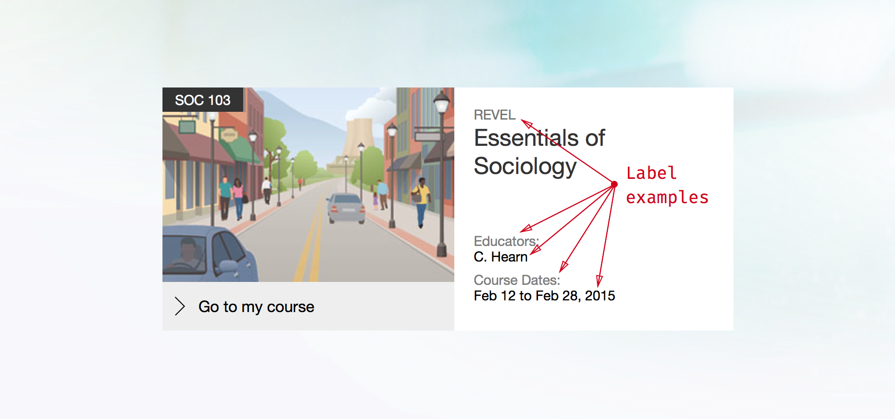
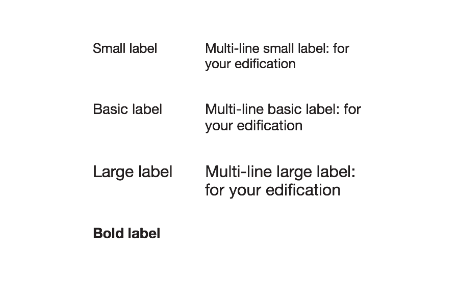
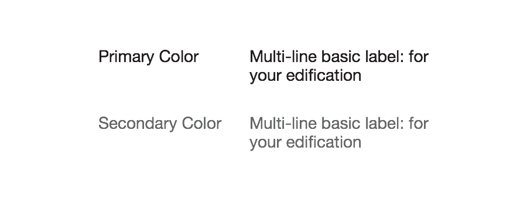
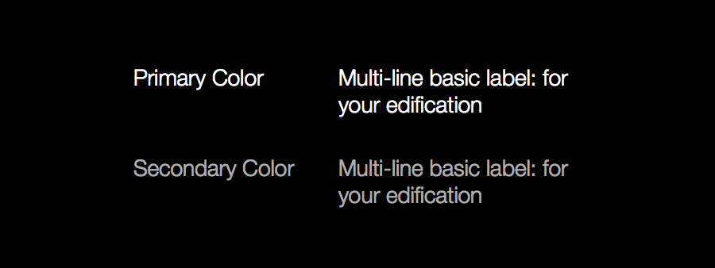
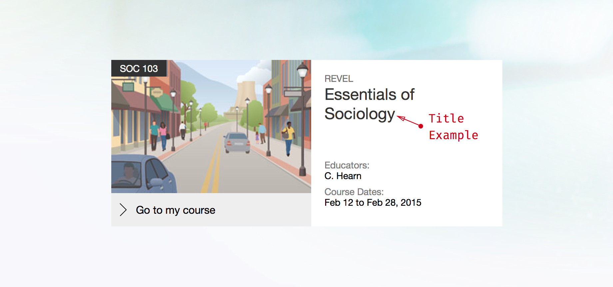
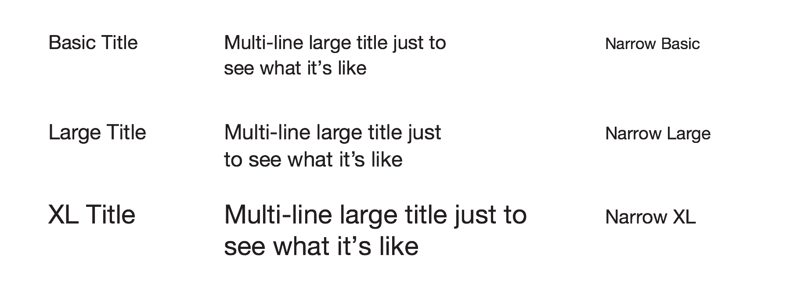
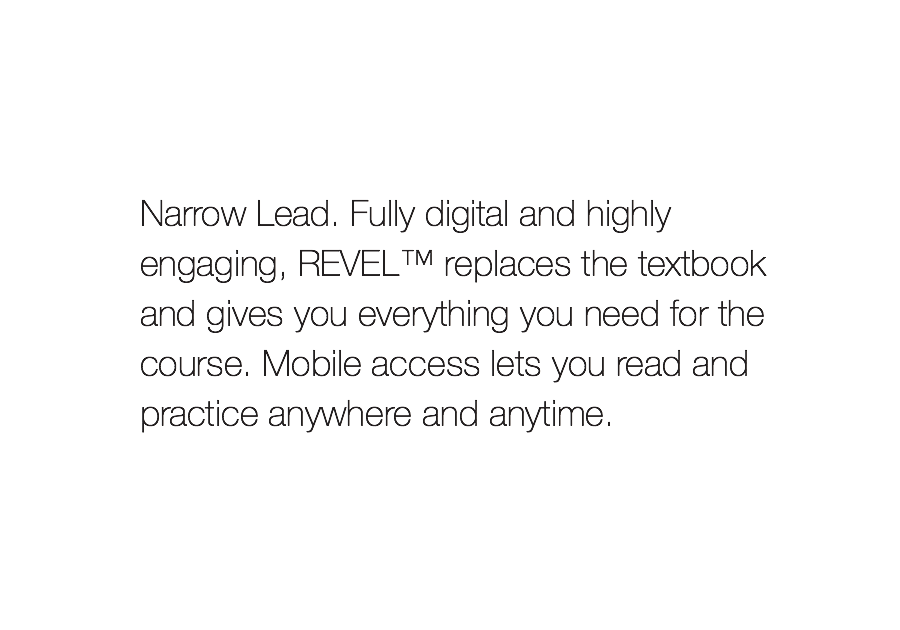
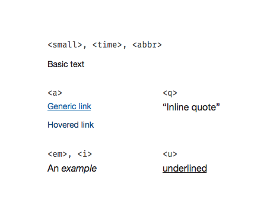
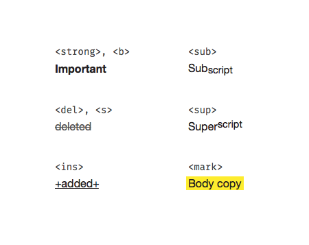

* TOC here
{:toc}


## Overview
<div markdown="1" class="tagline">
This component provides standard typographic styles for the platform.
</div>

<div markdown="1" class="feature_list">
- Single collection of all typographic styles
- Label styles for UI messages
- Title styles for UI headings
- Copy styles for content
- Inline styles (links, super/sub-script, etc.)
- Meets accessibility contrast requirements
</div>

<div markdown="1" class="usage">
Every instance of text should use a type style defined in this component. If you find a use case not covered by the styles here, make a request to modify this component. (Keeping all type styles in a single component makes it easy to maintain and update them.)
</div>

## Font Stack
All textual elements use the following font stack:

```
font-family: 'Helvetica Neue', Helvetica, Arial, sans-serif;
```

## Labels
<div class="section_text" markdown="1">
Much of the typography used in a web application consists of short names, labels, or single line bits of content. For example, in Console the course tile displays information like instructor names and course dates with labels.
</div>

<div class="images">
<div class="wide_image" markdown="1">


An example of labels in use on the Console course tile
</div>
</div>

### Size Variants
<div class="section_text" markdown="1">
There are four different sizes of label, *Basic*, *Small*, *Large*, and *Bold*:

Labels should primarily be used in single line scenarios. Make a particular effort to avoid using bold labels in a multi-line manner.
</div>

<div class="images">
<div class="narrow_image" markdown="1">


The four label sizes
</div>
</div>

### Color Variants
<div class="section_text" markdown="1">
Labels come in two colors, *Primary* and *Secondary*. There is an inverse palette available as well.
</div>

<div class="images">
<div class="narrow_image" markdown="1">


Standard colors
</div>

<div class="narrow_image" markdown="1">


Inverse colors
</div>
</div>

### Allowed Inline Elements
<div class="section_text" markdown="1">
In general, labels should not be styled beyond the basic styles listed above. If necessary, stick to the following list of inline elements.

* `<em>, <i>`
* `<a>`
* `<small>`
* `<time>`
* `<abbr>`
</div>


## Titles
<div class="section_text" markdown="1">
Titles are very similar to labels except they demarcate a logical section or container of content. In the previous example, the course name would be a title.
</div>

<div class="images">
<div class="wide_image" markdown="1">


Example title in use on the Console course tile
</div>
</div>

### Size variants
<div class="section_text" markdown="1">
There are three different sizes of title: *Basic*, *Large*, and *Extra Large*. These sizes will automatically scale down in narrow viewports.

### Allowed Inline Elements
In general, titles should not be styled beyond the basic styles listed above. If necessary, stick to the following list of inline elements.

* `<em>, <i>`
* `<small>`
* `<time>`
* `<abbr>`
</div>

<div class="images">
<div class="wide_image" markdown="1">


Standard title sizes, multiline versions, and the responsive sizes used when the viewport is narrower.
</div>
</div>


## Copy
<div class="section_text" markdown="1">
When you have a chunk of content to display, use one of these styles. Most regular content will use the *Basic Body* style.
</div>

<div class="images">
<div class="narrow_image" markdown="1">

</div>
</div>

### Lead Variant
<div class="section_text" markdown="1">
There is also a *Lead* variant which can be used for the first paragraph of a message or as part of a hero block for marketing materials.

It will automatically scale down for narrow viewports as well.

### Allowed Inline Elements
Copy is more flexible in this regard that labels or titles. You can include any of the inline elements covered by this component.
</div>

<div class="images">
<div class="wide_image" markdown="1">

</div>

<div class="narrow_image" markdown="1">

</div>
</div>


## Inline Elements
<div class="section_text" markdown="1">
There are a number of inline elements which can be used to modify the other type styles (see the list of allowed inline elements for each type style).

### Basic Elements

* `<a>`
* `<em>, <i>`
* `<strong>, <b>`
* `<u>`
* `<del>, <s>`
* `<ins>`
* `<q>`
* `<sub>, <sup>`
* `<mark>`
</div>

<div class="images">
<div class="narrow_image" markdown="1">

</div>

<div class="narrow_image" markdown="1">

</div>
</div>

### Non-visible Elements
<div class="section_text" markdown="1">
Some inline elements should be used only for semantic reasons and don't effect the visual style. These include:

* `<small>` (note: this element is used to represent side-comments and small print, including copyright and legal text, independent of its styled presentation)
* `<time>`
* `<abbr>`
</div>


## Redlines
Download them [here](./assets/redlines.zip).
