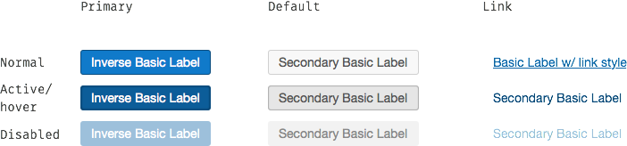
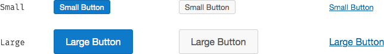

<aside>Under Development</aside>

# Buttons

* [Overview](#overview)
* [Button Types](#button-types)
* [Button Sizes](#button-sizes)
* [Redlines](#redlines)

## Overview
This component defines the standard visual style for buttons.

> **When to use this component**  
> Every instance of a button or button styled link should come from this component. See the sections below for information about when to ease each type of button.

### Feature summary:

- Single collection of all button styles
- Multiple button types including Primary, Default, and Link
- Small, Default, and Large button sizes
- Guaranteed compliance with Accessibility contrast requirements

|   Useful info          |                                       |
|------------------------|---------------------------------------|
|   Version              |    0.1.0                              |
|   Status               |    Active                             |
|   Origami component    |    [Registry link][reg-entry]         |
|   Product owner        |    [Joe Macaluso][jm-contact]         |
|   Designer             |    [Parker Malenke][pm-contact]       |
|   Designer             |    [Ed Zee][ez-contact]               |

[pm-contact]: mailto:parker.malenke@pearson.com
[ez-contact]: mailto:edward.zee@pearson.com
[jm-contact]: mailto:joe.macaluso@pearson.com
[reg-entry]:  https://origami.pearsoned.com/registry/components/o-buttons
[sk]:         ./assets/o-app-header.sketch

## Button Types

Buttons come in several different types. Each defines a normal, active/hover, and disabled state.

**Primary** indicates the main call to action and should only appear once per group of buttons.

**Default** is your basic button, it can appear multiple times in a given group.

**Link** indicates reduced importance of the option. ('Cancel' options should typically use this style, for example.)

## Button sizes
Buttons come in small, default, and large sizes. Prefer the default size but feel free to use these other sizes where they would fit better with surrounding content.

## Redlines
[Download the redline specification here](./assets/redlines.png)
