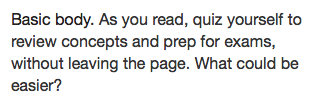

<aside>Under Development</aside>

# Typography

* [Overview](#overview)
* [Font Stack](#font-stack)
* [Labels](#labels)
* [Titles](#titles)
* [Copy](#copy)
* [Inline Elements](#inline-elements)
* [Redlines](#redlines)


## Overview
This component provides standard typographic styles for the platform.

> **When to use this component**  
> Every instance of text should use a type style defined in this component. If you find a use case not covered by the styles here, make a request to modify this component. (Keeping all type styles in a single component makes it easy to maintain and update them.)

### Feature summary:

- Single collection of all typographic styles
- Label styles for UI messages
- Title styles for UI headings
- Copy styles for content
- Inline styles (links, super/sub-script, etc.)
- Meets accessibility contrast requirements


|   Useful info          |                                       |
|------------------------|---------------------------------------|
|   Version              |    0.1.0                              |
|   Status               |    Active                             |
|   Origami component    |    [Registry link][reg-entry]         |
|   Product owner        |    [Joe Macaluso][jm-contact]         |
|   Designer             |    [Parker Malenke][pm-contact]       |
|   Designer             |    [Ed Zee][ez-contact]               |
|   Reference files      |    [Sketch][sk]                       |

[pm-contact]: mailto:parker.malenke@pearson.com
[ez-contact]: mailto:edward.zee@pearson.com
[jm-contact]: mailto:joe.macaluso@pearson.com
[reg-entry]:  https://origami.pearsoned.com/registry/components/o-app-header
[sk]:         ./assets/o-app-header.sketch


## Font Stack
All textual elements use the following font stack:

```
font-family: 'Helvetica Neue', Helvetica, Arial, sans-serif;
```

## Labels
Much of the typography used in a web application consists of short names, labels, or single line bits of content. For example, in Console the course tile displays information like instructor names and course dates with labels.


### Size Variants
There are four different sizes of label, *Basic*, *Small*, *Large*, and *Bold*:


Labels should primarily be used in single line scenarios. Make a particular effort to avoid using bold labels in a multi-line manner.

### Color Variants
Labels come in two colors, *Primary* and *Secondary*:


### Inverse Variants
There is also an inverse variant which works on backgrounds from the dark color palette:


### Allowed Inline Elements
In general, labels should not be styled beyond the basic styles listed above. If necessary, stick to the following list of inline elements.

* `<em>, <i>`
* `<a>`
* `<small>`
* `<time>`
* `<abbr>`


## Titles
Titles are very similar to labels except they demarcate a logical section or container of content. In the previous example, the course name would be a title.


### Size variants
There are three different sizes of title: *Basic*, *Large*, and *Extra Large*:


These sizes will automatically scale down in narrow viewports:


### Allowed Inline Elements
In general, titles should not be styled beyond the basic styles listed above. If necessary, stick to the following list of inline elements.

* `<em>, <i>`
* `<small>`
* `<time>`
* `<abbr>`


## Copy
When you have a chunk of content to display, use one of these styles. Most regular content will use the *Basic Body* style:



### Lead Variant
There is also a *Lead* variant which can be used for the first paragraph of a message or as part of a hero block for marketing materials.


It will automatically scale down for narrow viewports as well:


### Allowed Inline Elements
Copy is more flexible in this regard that labels or titles. You can include any of the inline elements covered by this component.


## Inline Elements
There are a number of inline elements which can be used to modify the other type styles (see the list of allowed inline elements for each type style).

### Basic Elements

* `<a>`
* `<em>, <i>`
* `<strong>, <b>`
* `<u>`
* `<del>, <s>`
* `<ins>`
* `<q>`
* `<sub>, <sup>`
* `<mark>`


### Non-visible Elements
Some inline elements should be used only for semantic reasons and don't effect the visual style. These include:

* `<small>` (note: this element is used to represent side-comments and small print, including copyright and legal text, independent of its styled presentation)
* `<time>`
* `<abbr>`


## Redlines
Download them [here](./assets/redlines.zip).
